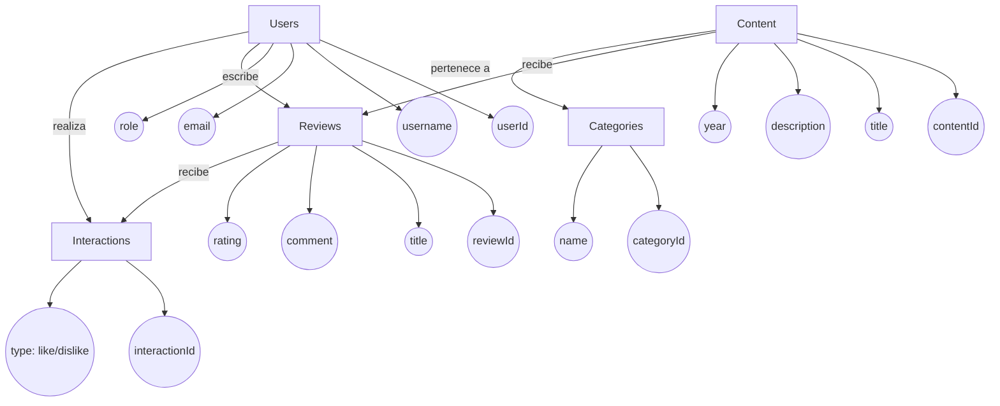
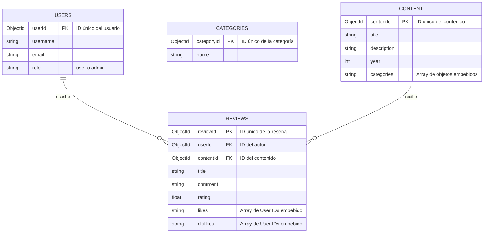
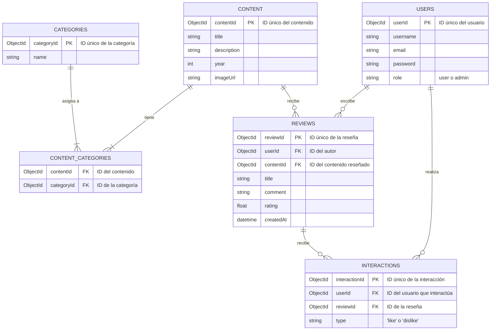

# Proyecto ExpressJS - KarenFlix 

<div align="center">
 <h2>Introducción</h2>
</div>

En este documento se detalla el proceso de diseño y desarrollo de la base de datos para la aplicación KarenFlix. Esta base de datos es el pilar de una aplicación full-stack construida en Node.js con Express, cuyo objetivo es permitir a los usuarios registrar, calificar y rankear películas, animes y series del universo geek.

Aquí se presenta de manera esquematizada la creación de la base de datos en MongoDB, enfocada en un almacenamiento, manipulación y consulta de la información que sea tanto eficiente como escalable. Para lograr este objetivo, el diseño se ha dividido en tres fases clásicas: el modelo conceptual, el lógico y el físico.

El modelo conceptual parte de los requerimientos del proyecto para ofrecer una visión de alto nivel. Identifica las entidades principales (como Usuarios, Contenido y Reseñas), sus atributos y las relaciones que existen entre ellas.

El modelo lógico traduce este esquema a una estructura adaptada a la base de datos NoSQL de MongoDB. En esta fase se definen las colecciones, los documentos y cómo se relacionarán mediante referencias (`ObjectId`).

Finalmente, el modelo físico representa la implementación final en MongoDB, detallando la estructura exacta de los documentos y los tipos de datos BSON específicos para cada campo, asegurando que la lógica del negocio esté correctamente reflejada en la base de datos.

## Caso de Estudio
Se pide diseñar y desarrollar una aplicación web que funcione como una plataforma social para aficionados a la cultura geek, permitiéndoles gestionar un catálogo de películas, series y animes. El sistema incluirá la administración de usuarios con diferentes roles, un catálogo de contenido, un sistema de reseñas con calificaciones y un mecanismo de interacción social (likes/dislikes).

### Estructura del Sistema
- Existen dos tipos de usuarios: usuarios registrados, que pueden reseñar contenido, y administradores, que gestionan el catálogo y las categorías.

- El flujo principal para un usuario es registrarse, buscar contenido, publicar una reseña con una calificación y dar like o dislike a las reseñas de otros.

- El sistema debe calcular un ranking ponderado para el contenido, basado en las calificaciones, las interacciones (likes/dislikes) y la fecha de las reseñas.

### Gestion de contenidos
- Los administradores gestionan el CRUD de las Categorías (ej. Anime, Ciencia Ficción).

- Los usuarios pueden proponer nuevo contenido, pero solo los administradores pueden aprobar y publicarlo en el catálogo.

- El contenido se identifica por atributos como título (único), descripción, año y categorías.

### Sistema de Reseñas e Interacción
- Los usuarios pueden crear, editar y eliminar sus propias reseñas sobre una pieza de contenido.

- Cada reseña incluye un título, un comentario y una calificación numérica (de 1 a 5, con decimales).

- Los usuarios pueden dar like o dislike a las reseñas de otros usuarios para valorar su utilidad.

## Planificación
### Construcción del Modelo Conceptual
Este modelo plasma gráficamente de forma general y estructurada la información que gestionará la aplicación KarenFlix, sin entrar en especificaciones técnicas como el uso de llaves primarias o detalles de implementación.

En la creación de este modelo, se analizó el contexto del flujo de trabajo de un usuario en la plataforma. Se enfocó en los detalles claves del ciclo de interacción: desde el registro de un usuario, la búsqueda de contenido (películas, series, animes), la creación de una reseña y la interacción con las reseñas de otros miembros de la comunidad. Este modelo permite una comunicación clara entre las reglas del negocio y el sistema de base de datos, garantizando una transición efectiva hacia las etapas más técnicas del diseño.

#### Descripción

Este modelo se realizó con base en la metodología entidad-relación, en la que una entidad es un objeto principal del sistema (como un Usuario, una Película o una Reseña) que se gestiona en la base de datos. Los atributos son las propiedades que describen a estas entidades. Finalmente, las relaciones describen los vínculos entre entidades, definiendo la interacción entre ellas.

#### Gráfica



### Descripción Técnica

El diseño del modelo conceptual presentado en la gráfica cuenta con los siguientes elementos:

- Las entidades principales del sistema se representan en los rectángulos (`Users`, `Content`, etc.).

- Los atributos que describen a cada entidad se muestran en círculos y están vinculados a su entidad correspondiente.

- Las relaciones entre las entidades se representan con flechas etiquetadas con la acción o verbo que describe la interacción (ej. `escribe`, `recibe`, `realiza`).

### Descripción de Entidades y Atributos

#### Users
- userID: Identificador único para cada cliente.

- username: Nombre de usuario dentro de la plataforma.

- email: Correo electrónico para registro y comunicación.

- role: Rol del usuario, que define sus permisos (user o admin).

#### Content (Movies, Series, Anime)
- contentId: Identificador único para cada película, serie o anime.

- title: Título oficial del contenido.

- description: Sinopsis o breve descripción.

- year: Año de lanzamiento.

#### Categories
- categoryId: Identificador único para cada categoría.

- name: Nombre de la categoría (ej. Ciencia Ficción, Anime, Superhéroes).

#### Reviews
- reviewId: Identificador único para cada reseña.

- title: Título que el usuario le da a su reseña.

- comment: El cuerpo o texto principal de la reseña.

- rating: Calificación numérica que el usuario asigna al contenido (1-5).

#### Interactions (Likes/Dislikes)
- interactionId: Identificador único para cada interacción.

- type: El tipo de interacción (`like` o `dislike`).

# Construcción del Modelo Lógico

Este modelo busca brindar más contexto que el modelo conceptual, agregando atributos, asignando tipos de datos y especificando requisitos para la información, incluyendo las llaves principales (PK), llaves foráneas (FK) y las relaciones entre colecciones.

Durante la construcción del modelo lógico, se añaden detalles para documentar completamente cómo se representarán en una base de datos las ideas generales descritas en el modelo conceptual. Este es nuestro primer borrador técnico antes de aplicar las reglas de normalización.

## Representación Gráfica



---

## Las Entidades y Atributos 


### 1. users
- _id: ObjectId `PRIMARY KEY`

- username: String

- email: String 

- role: String

### 2. Categories
- _id: ObjectId `PRIMARY KEY`

- name: String

### 3. Content
- _id: ObjectId `PRIMARY KEY`

- title: String

- description: String

- year: Number

- totalBudget: Number

- categories: Array EMBEDDED of Objects
    - _id: ObjectId
    - name: String

### 4. Reviews
- _id: ObjectId `PRIMARY KEY`

- userId: ObjectId `REFERENCE to users._id`

- contentId: ObjectId `REFERENCE to content._id`

- title: String

- comment: String

- rating: Number

- likes: Array `EMBEDDED` of ObjectId `REFERENCE to users._id`

- dislikes: Array `EMBEDDED` of ObjectId `REFERENCE to users._id`

## Relaciones y Cardinalidades 
 Se realizó las relaciones y cardinalidades respectivas del modelo lógico con sus entidades para tener mejor visualización de la base de datos: 
</br> 

### 1. Users - Reviews (1 a N): 
Un usuario puede escribir muchas reseñas, pero cada reseña pertenece a un solo usuario. 

### 2. Content - Reviews (1 a N):
 Una pieza de contenido puede tener muchas reseñas, pero cada reseña es sobre un solo contenido.

### 3. Content - Categories (N a M): 
Un contenido puede tener varias categorías. En este modelo inicial, la relación se maneja embebendo un arreglo de objetos de categorías dentro de cada documento de Content.

### 4. Reviews - Users (para Likes/Dislikes) (N a M): 
Una reseña puede ser likeada o no likeada por muchos usuarios. Esta relación se maneja embebendo dos arreglos de userIds (likes y dislikes) dentro de cada documento de Review.

</br>
</br>
</br>

# Normalización del Modelo Lógico

Se realizó el proceso de la normalización de las colecciones anteriormente visualizadas para organizar los datos de manera más eficiente, minimizando redundancias y dependencias transitivas en la base de datos en desarrollo.

## Primera Forma Normal (1FN)

Una tabla está en **1FN** si cumple con los siguientes criterios:

❖ Todos los atributos contienen valores atómicos (indivisibles).  
❖ Cada documento tiene una clave primaria única (en MongoDB, es el campo `_id`).  
❖ No deben existir grupos de atributos repetitivos dentro de un mismo documento. 

Para KarenFlix, aplicamos 1FN para asegurar que cada pieza de información esté claramente definida y no haya datos anidados complejos que dificulten las consultas. Esto implica separar entidades conceptuales en colecciones distintas.





# Descripción de Entidades en 1FN
## Las Entidades y Atributos
### 1. Users
Se encuentra en 1FN, ya que cuenta con una clave primaria única (_id) y cada uno de sus atributos (username, email, role, etc.) almacena un valor atómico y no repetitivo.

- _id: ObjectId `PRIMARY KEY`

- username: String

- email: String

- password: String (almacenado como hash)

- role: String

### 2. Content
Cumple con 1FN. La colección tiene una clave primaria única y todos sus campos son indivisibles, representando una sola pieza de información por atributo.

- _id: ObjectId `PRIMARY KEY`

- title: String

- description: String

- year: Number

- imageUrl: String

### 3. Categories
En 1FN, ya que cada documento tiene un `_id` único y el atributo `name` es atómico.

- _id: ObjectId `PRIMARY KEY`

- name: String


### 4. Content_Categories (Colección de Enlace)
Esta colección se crea para resolver la relación "muchos a muchos" entre `Content` y `Categories`, cumpliendo con 1FN. Cada documento representa una única asociación entre un contenido y una categoría.

- contentId: ObjectId REFERENCE to content._id

- categoryId: ObjectId REFERENCE to categories._id

### 5. Reviews
Cumple con 1FN. Tiene su propia clave primaria (`_id`) y todos sus campos son atómicos. Utiliza referencias (`userId`, `contentId`) para vincularse con otras colecciones.

- _id: ObjectId `PRIMARY KEY`

- userId: ObjectId REFERENCE to users._id

- contentId: ObjectId REFERENCE to content._id

- title: String

- comment: String

- rating: Number

- createdAt: Date

### 6. Interactions
Se encuentra en 1FN. Cada documento es único (`_id`) y todos sus campos son atómicos. Modela una única acción de un usuario sobre una reseña.

- _id: ObjectId `PRIMARY KEY`

- userId: ObjectId REFERENCE to users._id

- reviewId: ObjectId REFERENCE to reviews._id

- type: String

## Relaciones y Cardinalidades 

### 1. Users - Reviews (1 a N): 
Un usuario puede escribir muchas reseñas, pero cada reseña pertenece a un solo usuario. 

### 2. Content - Reviews (1 a N):
 Una pieza de contenido puede tener muchas reseñas, pero cada reseña es sobre un solo contenido.

### 3. Users - Interactions (1 a N):
Un usuario puede realizar muchas interacciones (likes/dislikes), pero cada interacción es de un solo usuario.

### 4. Reviews - Interactions (1 a N): 
Una reseña puede recibir muchas interacciones, pero cada interacción apunta a una sola reseña.

### 5. Content - Categories (N a M): 
Un contenido puede pertenecer a varias categorías, y una categoría puede agrupar mucho contenido. Esta relación se modela a través de la colección `Content_Categories`.

# Segunda Forma Normal (2FN)

Una tabla está en **2FN** si cumple con los siguientes criterios:

❖ Está en 1FN.  
❖ Todos los atributos no clave (no pertenecientes a una clave primaria compuesta) dependen completamente de la clave primaria.  

### Descripción

La Segunda Forma Normal se aplica a las tablas que ya cumplen con la Primera Forma Normal (1FN) y su principal objetivo es eliminar las **dependencias parciales**. Una dependencia parcial ocurre cuando un atributo que no es clave depende solo de una parte de la clave primaria, lo cual solo es posible si la clave primaria es compuesta (formada por más de un campo).

### Análisis para KarenFlix
En nuestro modelo lógico para MongoDB, todas las colecciones que definimos en 1FN (`Users`, `Content`, `Categories`, `Reviews`, etc.) utilizan el campo `_id` de tipo `ObjectId` como su clave primaria. Esta es una clave primaria simple, no compuesta.

Como resultado, todas nuestras colecciones cumplen con la 2FN por defecto, ya que es imposible que existan dependencias parciales sobre una clave que no está compuesta por múltiples campos.

### Justifación por entidad

- `Users`: Se encuentra en 2FN, ya que está en 1FN y su clave primaria (`_id`) es simple. Todos los demás atributos dependen funcionalmente de esta única clave.

- `Content`: Cumple con 2FN porque su clave primaria (`_id`) no es compuesta, eliminando la posibilidad de dependencias parciales. 

- `Categories`: En 2FN, ya que sus atributos dependen completamente de la clave primaria simple `_id`.

- `Reviews`: Se encuentra en 2FN. Atributos como rating o comment dependen del reviewId (_id), no de una parte de la clave.
 
- `Interactions`: Cumple con 2FN porque su clave primaria (`_id`) es simple y todos los demás atributos dependen directamente de ella.

- `Content_Categories`: También cumple con 2FN. Aunque esta tabla de enlace tiene dos llaves foráneas, su propia clave primaria sería un _id único para cada documento de enlace, por lo que no hay dependencias parciales.

Dado que no se requieren cambios estructurales para pasar de 1FN a 2FN en nuestro caso, el diagrama sigue siendo el mismo.


## Tercera Forma Normal (3FN)
Una colección o tabla está en 3FN si cumple con los siguientes criterios:
- Está en 2FN.

- No hay dependencias transitivas: ningún atributo no clave depende de otro atributo no clave.

### Descripción
El objetivo de la 3FN es asegurar que todos los atributos de un documento dependan únicamente de la clave primaria (`_id`) y no de otros campos dentro del mismo documento.

Por ejemplo, si en la colección `Reviews` guardáramos el `userId` y también el `username`, tendríamos una dependencia transitiva. El `username` depende del `userId` (que no es la clave primaria de la reseña), y el `userId` depende de la clave primaria de la reseña (`_id`). La 3FN elimina este tipo de problemas.

### Análisis para KarenFlix
Nuestro modelo lógico fue diseñado desde el principio para evitar dependencias transitivas. La estrategia clave fue separar cada entidad en su propia colección y usar referencias (`ObjectId`) para vincularlas, en lugar de duplicar datos.

Almacenamos el `userId` en una reseña, pero si queremos saber el nombre de ese usuario, hacemos una consulta a la colección `Users` usando esa referencia. Esto garantiza que los datos de los usuarios solo existen en un lugar (`Users`) y el resto de las colecciones dependen directamente de sus propias claves primarias.

### Justifación por entidad

- `Users`:  Se encuentra en 3FN, ya que está en 2FN y todos sus atributos (username, email, role) dependen única y directamente de la clave primaria _id, sin dependencias entre ellos.

- `Content`: Cumple con 3FN. Atributos como title y description dependen directamente del _id del contenido.

- `Categories`: Se encuentra en 3FN, ya que el name de la categoría depende solo de su _id.

- `Reviews`:  Está en 3FN. Se evita una dependencia transitiva al almacenar solo la referencia userId en lugar de datos como el username. La información de la reseña (calificación, comentario) depende directamente del _id de la reseña, no de los datos del usuario o del contenido.
 
- `Interactions`:  En 3FN, puesto que el campo type depende únicamente del _id de la interacción.

Como no se requieren cambios, el diagrama se mantiene igual.


# Construcción del Modelo Físico

Se diseñó el modelo físico considerando el modelo lógico normalizado, que incluye todas las entidades, sus atributos y las relaciones entre ellas. Además, este modelo detalla los tipos de datos de cada atributo, estructurados en colecciones utilizando el formato del Sistema de Gestión de Bases de Datos (SGBD) MongoDB.

## Descripción

El modelo físico se diseñó para funcionar en MongoDB, donde cada entidad se representa como una colección. Los documentos dentro de estas colecciones contienen los atributos correspondientes, organizados como pares clave-valor con tipos de datos específicos de BSON (Binary JSON), como `ObjectId`, `String`, `Number` y `Date`.

Una decisión de diseño importante en este modelo físico es cómo manejar la relación "muchos a muchos" entre `Content` y `Categories`. En lugar de usar una colección de enlace (como en el modelo lógico normalizado), se opta por un enfoque más eficiente y común en NoSQL: embeber un arreglo de referencias (`ObjectId`) de categorías dentro de cada documento de `Content`. Esto reduce la necesidad de hacer consultas adicionales (`$lookup`) y optimiza el rendimiento para la lectura de datos.

## Colecciones
### users
Almacena la información de los usuarios registrados en la plataforma.
```json
{
  "_id": "ObjectId",
  "username": "String",
  "email": "String",
  "password": "String",
  "role": "String",
  "createdAt": "Date"
}
```

### categories
Contiene las categorías que los administradores pueden asignar al contenido.
```json
{
  "_id": "ObjectId",
  "name": "String",
  "createdAt": "Date"
}
```

### content
El catálogo de películas, series y animes. Incluye un arreglo de ObjectId para vincular a las categorías.
```json
{
  "_id": "ObjectId",
  "title": "String",
  "description": "String",
  "year": "Number",
  "imageUrl": "String",
  "categoryIds": "[ObjectId]",
  "createdAt": "Date"
}
```

### reviews
Guarda las reseñas que los usuarios escriben, vinculando un usuario con una pieza de contenido.
```json
{
  "_id": "ObjectId",
  "userId": "ObjectId",
  "contentId": "ObjectId",
  "title": "String",
  "comment": "String",
  "rating": "Number",
  "createdAt": "Date",
  "updatedAt": "Date"
}
```

### interactions
Registra cada "like" o "dislike" que un usuario le da a una reseña específica.
```json
{
  "_id": "ObjectId",
  "userId": "ObjectId",
  "reviewId": "ObjectId",
  "type": "String",
  "createdAt": "Date"
}
```
|-- [1.Ayuda](config)

  

